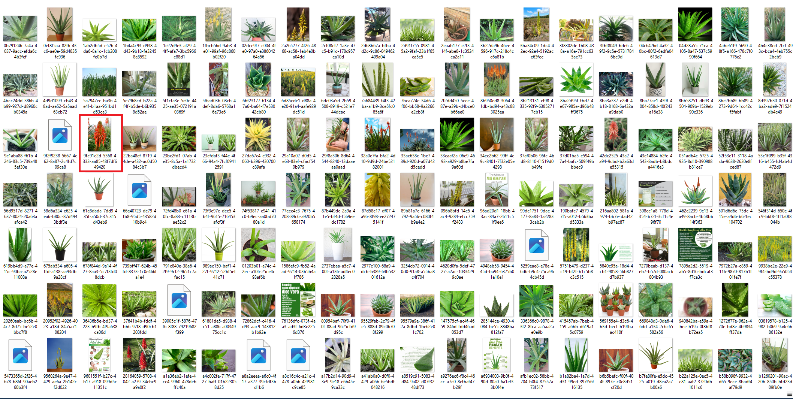

# How to create a AI model that identifies plants species, for coders.

## Table of Contents
1. Introduction
1. Setting Up the Project Folder Structure
1. Installing Dependencies for Your Project
1. Creating a Virtual Environment for Python
1. Installing Python Dependencies
1. Gathering Data
1. Creating the Script to Download Images
1. Cleaning the Data
1. Creating the Model
1. Script Explanation
1. Running the Model Training Script
1. Creating the Web Server
1. Setting Up Flask
1. Defining the API Endpoint
1. Testing the Web Server
1. Core Concepts

## Introduction

In this blog post, we'll be building a basic AI model for identifying different plant species. This tutorial assumes that you have coding experience and are comfortable with programming concepts but may not be familiar with AI.

We will use the following tools and libraries:

- FastAI library
- Python with flask for a web server

For a deeper understanding of AI concepts, you can follow the course [the course from this tutorial is based](https://course.fast.ai/)

Let's dive in and create a model capable of identifying various plant species, including:

- Aloe vera
- Aptenia cordifolia
- Spathiphyllum
- Epipremnum aureum
- Sansevieria trifasciata

## Setting Up the Project Folder Structure

To begin, let's create the following folder structure for our project:

```
plantai
├───backend
```

The "backend" folder will contain the code for both the AI model and the web server. Alternatively, you can choose to keep everything in the root folder, but we recommend using this structure for organization.

To create this structure, you can either use the terminal or your file explorer.

## Installing Dependencies for Your Project

Since we will be using Python for the backend, we need to install the necessary dependencies.

## Creating a virtual environment for python

First, create a virtual environment to isolate your project's dependencies from the global Python installation. In your terminal, navigate to the "backend" folder and run the following commands:

```bash
python -m venv venv
```

This creates a virtual environment named "venv." Activate the virtual environment with this command:

```bash
. venv\bin\activate
```

With the virtual environment activated, we can now install the required Python dependencies.

### Installing python dependencies

In the terminal, make sure you are in the "backend" folder, and then run the following commands:

```bash
pip install fastai
pip install flask
pip install flask_cors
```

This will install the necessary Python libraries for your project.


## Gathering data

To train our model effectively, we need a substantial amount of data. For this plant identification model, we require images of the plant species we aim to identify. Fortunately, the FastAI library includes pre-trained models, reducing the amount of data needed. Approximately 100 images per species should suffice for good results.

## Creating the script to download the images

Inside the backend folder, create a file called `download_images.py` and insert the next code:

```python
from fastbook import *

path = Path("plants")
plants_types = 'aloe vera', 'Aptenia cordifolia', 'spathiphyllum', 'epipremnum aureum', 'sansevieria trifasciata'

if path.exists():
    for o in plants_types:
        dest = (path/o)
        dest.mkdir(exist_ok=True)
        results = search_images_ddg(f'{o} plant')
        download_images(dest, urls=results)
```

This script downloads images from DuckDuckGo, which we will use to train our model. Be aware that it will download a substantial number of images, so ensure you have enough disk space and be patient during the download process. Additionally, manually create the "plants" folder within the "backend" directory.

Your folder structure should now resemble this:

```
plantai
├───backend
│   └───plants
│---download_images.py
```

Run the script by executing the following command in the terminal from the "backend" folder:

```bash
python download_images.py
```

This command initiates the image download process, which may take some time.

Upon completion, your folder structure should appear as follows:

```
plantai
├───backend
│   └───plants
│       ├───aloe vera
│       ├───Aptenia cordifolia
│       ├───epipremnum aureum
│       ├───sansevieria trifasciata
│       └───spathiphyllum
│---download_images.py
```

This indicates that the script successfully downloaded the required images.

## Cleaning the data

Now that we have the images, it's crucial to clean them. Data cleaning involves removing images that are not suitable for our model. This includes deleting images that are not plants, not part of the supported plant species, contain flowers or fruits (rather than the whole plant), depict sick plants, are unclear, are too similar, or have irrelevant elements like people or insects.

Data cleaning can be a time-consuming task but is essential for creating a high-quality dataset. For each plant species, carefully review and delete unsuitable images using your file explorer.

Easiest way to do this is to open the folder with the images and delete the images that are not useful, you can use your file explorer to do this.

For example:



The picture in the red square is a flower of the aloe vera plant, this is not useful for our model, since we are trying to identify the plant, not the flower, so we are going to delete this image.

After cleaning, your folder structure should still resemble this:


```
plantai
├───backend
│   └───plants
│       ├───aloe vera
│       ├───Aptenia cordifolia
│       ├───epipremnum aureum
│       ├───sansevieria trifasciata
│       └───spathiphyllum
│---download_images.py
```

## Creating the model

Now that we have prepared our dataset, we can create the model. Create a file named `train_model.py` inside the "backend" folder and insert the following code:

```python
from fastbook import *
from fastai.vision.widgets import *

path = Path("plants")

plants = DataBlock(
    blocks=(ImageBlock, CategoryBlock), 
    get_items=get_image_files, 
    splitter=RandomSplitter(valid_pct=0.2, seed=42),
    get_y=parent_label,
    item_tfms=Resize(128))

plants = plants.new(
    item_tfms=RandomResizedCrop(224, min_scale=0.5),
    batch_tfms=aug_transforms())
dls = plants.dataloaders(path)

learn = vision_learner(dls, resnet18, metrics=error_rate)
learn.fine_tune(6)


learn.export()
```

This script creates the model, trains it, and exports it to a file named `export.pkl`. This file will be used by the web server to identify plants.

Your folder structure should now look like this:

```
plantai
├───backend
│   └───plants
│       ├───aloe vera
│       ├───Aptenia cordifolia
│       ├───epipremnum aureum
│       ├───sansevieria trifasciata
│       └───spathiphyllum
│   │---download_images.py
│   │---train_model.py
├───client
```

## Script explanation

Let's break down the script:

```python
from fastbook import *
from fastai.vision.widgets import *
```

These lines import the FastAI library, which provides useful functions for creating AI models, and the widgets library for visualizations.

```python
path = Path("plants")
```

This line creates a path object pointing to the folder containing our plant images.

```python
plants = DataBlock(
    blocks=(ImageBlock, CategoryBlock), 
    get_items=get_image_files, 
    splitter=RandomSplitter(valid_pct=0.2, seed=42),
    get_y=parent_label,
    item_tfms=Resize(128))
```

This block of code defines a DataBlock object, which specifies how to process our data for model training. It includes the following parameters:

- blocks: Indicates the data types (images and categories) we are using.
- get_items: Specifies the function to fetch image files.
- splitter: Defines how to split the data into training and validation sets.
- get_y: Specifies how to get the category labels from the folder structure.
- item_tfms: Specifies image transformations, such as resizing to 128x128 pixels.

```python
plants = plants.new(
    item_tfms=RandomResizedCrop(224, min_scale=0.5),
    batch_tfms=aug_transforms())
dls = plants.dataloaders(path)
```

This part modifies the DataBlock object to include additional transformations, such as random resized cropping and augmentations like rotation and zoom. It then creates data loaders (dls) from our dataset.

```python
learn = vision_learner(dls, resnet18, metrics=error_rate)
learn.fine_tune(6)
```

Here, we create a learner object, which is responsible for training our model. The parameters include:

- `dls`: The data loaders we previously created.
- `resnet18`: The model architecture (ResNet-18) we'll use.
- `metrics`: The metric for evaluating the model's performance (error rate).

The `fine_tune` method fine-tunes the pre-trained model on our specific dataset.

```python
learn.export()
```

Finally, we export the trained model to a file named `export.pkl` for later use.


## Running the script

To train the model, open a terminal, navigate to the "backend" folder, and execute the following command:

```bash
python train_model.py
```

This will start the model training process, which may take some time. Be patient during this phase.

After the script finishes, your folder structure should remain as shown:

```
plantai
├───backend
│   └───plants
│       ├───aloe vera
│       ├───Aptenia cordifolia
│       ├───epipremnum aureum
│       ├───sansevieria trifasciata
│       └───spathiphyllum
│   │---download_images.py
│   │---train_model.py
│   │---export.pkl
```

With your model trained, we can proceed to create the web server.

## Creating the web server

As a developer, you may already be familiar with web servers, but don't worry if you're not; we'll create a simple web server using Python and Flask.

In the "backend" folder, create a file named `server.py` and insert the following code:

```python
from flask import Flask
from flask import request
from flask_cors import CORS
from classify_plants import classify_image

app = Flask(__name__)
CORS(app)

@app.route('/plants/upload', methods=['POST'])
def upload_file():
    if request.method == 'POST':
        if 'plant_image' not in request.files:
            return {
                "success": "false",
                "error": "No file part"
            }
    
        f = request.files['plant_image']
        pred = classify_image(f)
        return {
            "success": "true",
            "prediction": pred,
            "error": "None"
        }
```

This code sets up a basic web server that receives an image and returns the model's prediction. It utilizes a function called `classify_image``, which we'll create shortly.

Create a file named `classify_plants.py` in the "backend" folder and insert the following code:

```python
from fastai.vision.all import *
from fastai.vision.utils import *
import matplotlib.pyplot as plt

learn2 = load_learner('plants/plantsModel.pkl')

categories = ('Aptenia cordifolia', 'aloe vera', 'epipremnum aureum', 'sansevieria trifasciata', 'spathiphyllum')

def classify_image(img, threshold=0.7):
    imgToPredict = plt.imread(img)
    pred = learn2.predict(imgToPredict)
    pred_probs_dec = [f"{p:.20f}" for p in pred[2].tolist()]
    max_prob = max(pred[2].tolist())
    if max_prob >= threshold:
        return pred[0], dict(zip(categories, pred_probs_dec)), max_prob
    else:
        return "Uncertain", dict(zip(categories, pred_probs_dec)), max_prob

def getClassesForLearner(learner):
    return learner.dls.vocab

def getLearner():
    return learn2

def getCategories():
    return categories

def getProbsInDecimal(pred):
    pred_probs_dec = [f"{p:.20f}" for p in pred[2].tolist()]
    return pred_probs_dec
```

Let's explain the code:

```python
from fastai.vision.all import *
from fastai.vision.utils import *
import matplotlib.pyplot as plt
```

This imports the fastai library, this library contains a lot of useful functions to create AI models, and the matplotlib library, this library is going to be used to plot the images.

```python
learn2 = load_learner('export.pkl')
```

This loads the model we created before, this model is going to be used to classify the images.

```python
categories = ('Aptenia cordifolia', 'aloe vera', 'epipremnum aureum', 'sansevieria trifasciata', 'spathiphyllum')
```

This creates a tuple with the categories we are supporting, this is going to be used to return the categories in the response.

```python
def classify_image(img, threshold=0.7):
    imgToPredict = plt.imread(img) # We read the image
    pred = learn2.predict(imgToPredict) # We predict the image, using the model we created before
    pred_probs_dec = [f"{p:.20f}" for p in pred[2].tolist()] # We get the probabilities of the prediction
    max_prob = max(pred[2].tolist()) # We get the max probability of the prediction
    if max_prob >= threshold: # If the max probability is greater than the threshold, to prevent uncertain predictions
        return pred[0], dict(zip(categories, pred_probs_dec)), max_prob # We return the prediction, the probabilities and the max probability
    else:
        return "Uncertain", dict(zip(categories, pred_probs_dec)), max_prob # We return uncertain, since we are not sure if the prediction went well.
```

This function is going to be used to classify the image, it receives the next parameters:

- img: This is the image that is going to be classified.
- threshold: This is the threshold that is going to be used to determine if the prediction is correct or not, this is going to be used to determine if the prediction is uncertain or not.

This function returns a tuple with the next values:

- The prediction
- The probabilities of the prediction
- The max probability of the prediction

The rest of the code are just helper functions.

## Running the web server

To start the web server, open a terminal, navigate to the "backend" folder, activate the virtual environment if you haven't already, and execute the following command:

```bash
flask --app server run
```

You should see output similar to the following:


```
 * Serving Flask app 'server'
 * Debug mode: off
WARNING: This is a development server. Do not use it in a production deployment. Use a production WSGI server instead.
 * Running on http://127.0.0.1:5000
Press CTRL+C to quit
```

This indicates that the web server is running successfully. Now, we can test it.

## Testing the web server

To test the web server, you can use a tool like Postman. If you don't have Postman installed, you can download it here.

1. Open Postman and create a new request.
1. Set the request method to POST.
1. Set the URL to `http://localhost:5000/plants/upload`.
1. In the "Body" tab, select "form-data."
1. Add a new key named `plant_image` with the type set to "file."
1. Select an image of a plant from your computer.
1. Click the "Send" button.

If everything is set up correctly, you should receive a response with the prediction, which will look similar to this:
    
```json
{
    "error": "None",
    "prediction": [
        "sansevieria trifasciata",
        {
            "Aptenia cordifolia": "0.00000279084542853525",
            "aloe vera": "0.00022857579460833222",
            "epipremnum aureum": "0.00010371765529271215",
            "sansevieria trifasciata": "0.99966001510620117188",
            "spathiphyllum": "0.00000483665144201950"
        },
        0.9996600151062012
    ],
    "success": "true"
}
```

## Conclusion
In conclusion, we walked you through the process of creating a simple AI model for plant species identification. While we didn't delve too deeply into the theoretical aspects of AI, you now have a practical understanding of how to set up a project, gather data, clean it, create a model, and even set up a basic web server for deploying your AI model.

Remember that the world of AI is vast and continually evolving. To deepen your knowledge, consider exploring the following AI concepts and areas:

- Machine Learning
- Neural Networks
- Data Preparation
- Model Evaluation
- Transfer Learning
- Web Deployment
- Ethical AI
- AI Libraries

Learning AI is an ongoing journey, and there's always more to discover and explore. Continue to build on the foundation you've established in this tutorial and stay curious about the latest advancements in artificial intelligence.

Happy coding!
